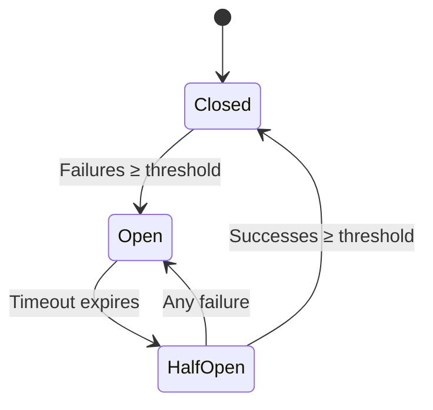

# Bizkit Symfony CircuitBreakerBundle

[](https://packagist.org/packages/bizkit/symfony-circuit-breaker-bundle)
[](https://github.com/HypeMC/symfony-circuit-breaker-bundle/actions)
[](https://codecov.io/gh/HypeMC/symfony-circuit-breaker-bundle)
[](https://packagist.org/packages/bizkit/symfony-circuit-breaker-bundle)

Bizkit Symfony CircuitBreakerBundle integrates
[`gabrielanhaia/php-circuit-breaker`](https://github.com/gabrielanhaia/php-circuit-breaker) with Symfony HttpClient. It
decorates configured HTTP clients and records request successes or failures in a PSR-6 cache-backed circuit breaker.

## What Is a Circuit Breaker?

HTTP integrations often depend on services outside your process: payment providers, search APIs, email gateways, or
internal services owned by another team. When one of those services starts timing out or returning server errors,
continuing to send every request can make your own application slower and harder to recover.

A **circuit breaker** tracks those failures and changes how calls are handled while the dependency is unhealthy. In the
normal closed state, requests are sent as usual. After enough failures, the circuit opens and new requests fail quickly
instead of waiting on the remote service. Once the timeout expires, the circuit allows trial requests in a half-open
state to decide whether normal traffic can resume.



| State         | Behavior                                                               |
|---------------|------------------------------------------------------------------------|
| **Closed**    | Requests are sent normally, while failures are counted.                |
| **Open**      | Requests fail fast and the remote service is not called.               |
| **Half-Open** | Trial requests are allowed so the circuit can detect service recovery. |

## Features

- **Symfony HttpClient integration**: Decorates the main `http_client` service and configured scoped HTTP client
  services.

- **Per-client circuit breaker configuration**: Configure thresholds, time windows, open/half-open timeouts, and
  exception behavior for the main client and each scoped client.

- **PSR-6 cache storage**: Uses a configured cache pool service as the storage backend for circuit breaker state.

- **Symfony Event Dispatcher integration**: Dispatches php-circuit-breaker events through Symfony's event dispatcher
  when `symfony/event-dispatcher` is installed.

- **Debug logging**: Logs blocked requests and recorded outcomes to the `bizkit_circuit_breaker` logger channel when a
  `logger` service is available.

- **Console commands**: Optional commands are available when `symfony/console` is installed to inspect, force, and clear
  circuit breaker state.

## Requirements

- [PHP 8.1](https://www.php.net/releases/8_1_0.php) or higher
- [Symfony 6.4](https://symfony.com/roadmap/6.4), [Symfony 7.4](https://symfony.com/roadmap/7.4), or higher
- [`gabrielanhaia/php-circuit-breaker`](https://github.com/gabrielanhaia/php-circuit-breaker) 3.0 or higher

## Installation

Require the bundle using [Composer](https://getcomposer.org/):

```sh
composer require bizkit/symfony-circuit-breaker-bundle
```

If your project doesn't use [Symfony Flex](https://github.com/symfony/flex), enable the bundle in `config/bundles.php`:

```php
return [
    Bizkit\CircuitBreakerBundle\BizkitCircuitBreakerBundle::class => ['all' => true],
];
```

Create a configuration file under `config/packages/bizkit_circuit_breaker.yaml`:

```yaml
bizkit_circuit_breaker:

    # Circuit breaker configuration for the main Symfony HttpClient service.
    http_client:
        # Service ID of the PSR-6 cache pool used to store circuit breaker state.
        storage:              cache.circuit_breaker
        failure_threshold:    5
        success_threshold:    1
        time_window:          20
        open_timeout:         30
        half_open_timeout:    20
        exceptions_enabled:   false

        # Service ID of the failure checker used to decide when a response
        # should count as a circuit breaker failure.
        failure_checker:      bizkit_circuit_breaker.failure_checker.default

    # Circuit breaker configuration for scoped Symfony HttpClient services.
    scoped_http_clients:
        api.client:
            # Service ID of the PSR-6 cache pool used to store circuit breaker state.
            storage:              cache.circuit_breaker
            failure_threshold:    3
            success_threshold:    1
            time_window:          20
            open_timeout:         60
            half_open_timeout:    20
            exceptions_enabled:   false

            # Service ID of the failure checker used to decide when a response
            # should count as a circuit breaker failure.
            failure_checker:      bizkit_circuit_breaker.failure_checker.default
```

The `storage` value must be the service ID of a PSR-6 cache pool. A client without a configured `storage` value is not
decorated. Omit `failure_checker` to use the default transport-error and `5xx` failure behavior.

You can use an existing pool, or define a dedicated Symfony cache pool:

```yaml
framework:
    cache:
        pools:
            cache.circuit_breaker:
                adapter: cache.adapter.redis

bizkit_circuit_breaker:
    http_client:
        storage: cache.circuit_breaker
```

## Usage

Once configured, use Symfony HttpClient normally. The bundle decorates the configured services during container
compilation:

```php
use Symfony\Contracts\HttpClient\HttpClientInterface;

final class ApiClient
{
    public function __construct(
        private readonly HttpClientInterface $client,
    ) {
    }

    public function fetch(): string
    {
        return $this->client
            ->request('GET', 'https://example.com/api')
            ->getContent();
    }
}
```

Override the circuit breaker service name for a single request with Symfony's `extra` option:

```php
$response = $client->request('GET', 'https://example.com/api', [
    'extra' => [
        'circuit_breaker' => [
            'service_name' => 'payments.stripe',
        ],
    ],
]);
```

By default, successful responses record successes when the response body completes. Server errors (`5xx`) and transport
errors record failures. If your API uses different status codes or response metadata to indicate failure, see
[Custom Failure Rules](#custom-failure-rules).

When the circuit is open and `exceptions_enabled` is `false`, the decorated client returns a synthetic `503` response.
When `exceptions_enabled` is `true`, the underlying circuit breaker throws its open-circuit exception.

### Scoped HTTP Clients

Use `scoped_http_clients` when you want different circuit breaker settings per HTTP client service:

```yaml
framework:
    http_client:
        scoped_clients:
            api.client:
                base_uri: 'https://example.com/api/'

bizkit_circuit_breaker:
    scoped_http_clients:
        api.client:
            storage: cache.circuit_breaker
            failure_threshold: 3
```

Scoped clients do not inherit settings from `http_client`. Each configured scoped client uses its own defaults unless
values are provided explicitly.

### Custom Failure Rules

The default failure rules treat transport errors and `5xx` responses as failures. To change that behavior, implement
`FailureCheckerInterface` and configure the service ID under `failure_checker`:

```php
namespace App\Http;

use Bizkit\CircuitBreakerBundle\FailureChecker\FailureCheckerInterface;
use Symfony\Component\HttpClient\Response\AsyncContext;
use Symfony\Contracts\HttpClient\ChunkInterface;

final class ApiFailureChecker implements FailureCheckerInterface
{
    public function __invoke(
        ChunkInterface $chunk,
        AsyncContext $context,
        string $serviceName,
    ): bool {
        if (null !== $chunk->getError()) {
            return true;
        }

        return $chunk->isFirst() && $context->getStatusCode() >= 400;
    }
}
```

Reference it from the main client or any scoped client configuration:

```yaml
bizkit_circuit_breaker:
    http_client:
        failure_checker: App\Http\ApiFailureChecker
```

Override the failure checker for a single request with `extra.circuit_breaker.failure_checker`:

```php
use Symfony\Component\HttpClient\Response\AsyncContext;
use Symfony\Contracts\HttpClient\ChunkInterface;

$response = $client->request('GET', 'https://example.com/api', [
    'extra' => [
        'circuit_breaker' => [
            'failure_checker' => static function (
                ChunkInterface $chunk,
                AsyncContext $context,
                string $serviceName,
            ): bool {
                if (null !== $chunk->getError()) {
                    return true;
                }

                return $chunk->isFirst() && 404 === $context->getStatusCode();
            },
        ],
    ],
]);
```

### Logging

When a `logger` service is available, decorated clients write debug messages to the `bizkit_circuit_breaker` logger
channel. With MonologBundle, filter that channel like any other Symfony logger channel:

```yaml
monolog:
    handlers:
        circuit_breaker:
            type: stream
            path: '%kernel.logs_dir%/circuit_breaker.log'
            level: debug
            channels: [ 'bizkit_circuit_breaker' ]
```

### Console Commands

When `symfony/console` is installed, the bundle registers commands to inspect state, force a state, and clear overrides.

```sh
php bin/console bizkit:circuit-breaker:status http_client
php bin/console bizkit:circuit-breaker:force http_client open --ttl=60
php bin/console bizkit:circuit-breaker:clear http_client
```

Use the configured service name as the command argument. For the main client, use `http_client`. For scoped clients, use
the scoped client service ID.

## Versioning

This project follows [Semantic Versioning 2.0.0](https://semver.org/).

## Reporting Issues

Use the project's issue tracker to report bugs or request improvements.

## License

See the [LICENSE](LICENSE) file for details (MIT).
