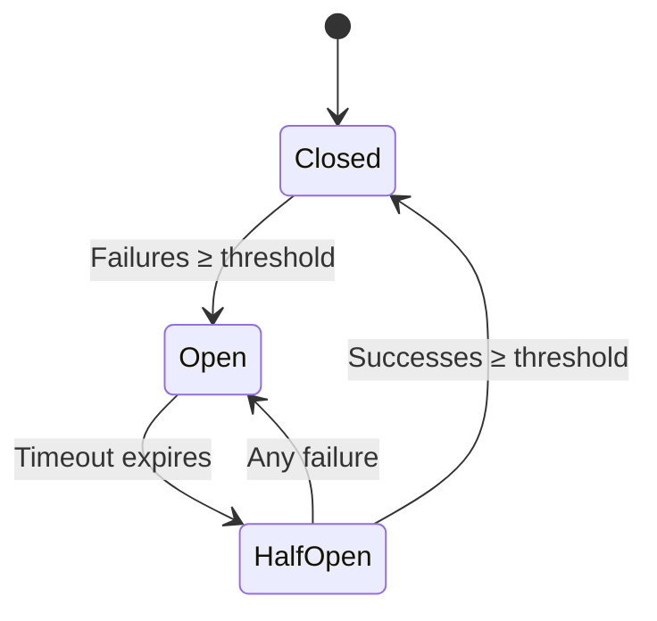

# Bizkit Symfony CircuitBreakerBundle

[](https://packagist.org/packages/bizkit/symfony-circuit-breaker-bundle)
[](https://github.com/HypeMC/symfony-circuit-breaker-bundle/actions/workflows/tests.yaml)
[](https://codecov.io/gh/HypeMC/symfony-circuit-breaker-bundle)
[](https://packagist.org/packages/bizkit/symfony-circuit-breaker-bundle)

Bizkit Symfony CircuitBreakerBundle adds circuit breaker behavior to Symfony HttpClient. It decorates configured HTTP
clients and records request successes or failures in a PSR-6 cache-backed circuit breaker.

## What Is a Circuit Breaker?

HTTP integrations often depend on services outside your process: payment providers, search APIs, email gateways, or
internal services owned by another team. When one of those services starts timing out or returning server errors,
continuing to send every request can make your own application slower and harder to recover.

A **circuit breaker** tracks those failures and changes how calls are handled while the dependency is unhealthy. In the
normal closed state, requests are sent as usual. After enough failures, the circuit opens and new requests fail quickly
instead of waiting on the remote service. Once the timeout expires, the circuit allows trial requests in a half-open
state to decide whether normal traffic can resume.



| State         | Behavior                                                               |
|---------------|------------------------------------------------------------------------|
| **Closed**    | Requests are sent normally, while failures are counted.                |
| **Open**      | Requests fail fast and the remote service is not called.               |
| **Half-Open** | Trial requests are allowed so the circuit can detect service recovery. |

## Features

- **Symfony HttpClient integration**: Decorates the main `http_client` service and configured scoped HTTP client
  services.

- **Per-client circuit breaker configuration**: Configure thresholds, failure time windows, and open/half-open
  timeouts for the main client and each scoped client.

- **PSR-6 cache storage**: Uses a configured cache pool service as the storage backend for circuit breaker state.

- **Custom failure rules**: Decide which responses or transport errors should count as circuit breaker failures.

- **Service name resolution**: Use the configured client service name, resolve the name from the request host, or
  customize it for a single request.

- **Debug logging**: Logs blocked requests and recorded outcomes to the `bizkit_circuit_breaker` logger channel when a
  `logger` service is available.

- **Console commands**: Optional commands are available when `symfony/console` is installed to inspect, open, and close
  circuit breaker state.

## Requirements

- [PHP 8.1](https://www.php.net/releases/8_1_0.php) or higher
- [Symfony 6.4](https://symfony.com/roadmap/6.4), [Symfony 7.4](https://symfony.com/roadmap/7.4), or higher

## Installation

Require the bundle using [Composer](https://getcomposer.org/):

```sh
composer require bizkit/symfony-circuit-breaker-bundle
```

If your project doesn't use [Symfony Flex](https://github.com/symfony/flex), enable the bundle in `config/bundles.php`:

```php
return [
    Bizkit\CircuitBreakerBundle\BizkitCircuitBreakerBundle::class => ['all' => true],
];
```

Create a configuration file under `config/packages/bizkit_circuit_breaker.yaml`:

```yaml
bizkit_circuit_breaker:

    # Circuit breaker configuration for the main Symfony HttpClient service.
    http_client:
        # Service ID of the PSR-6 cache pool used to store circuit breaker state.
        storage:               cache.circuit_breaker
        failure_threshold:     5
        success_threshold:     1
        failure_time_window:   20
        open_timeout:          30
        half_open_timeout:     20
        half_open_max_attempts: 1

        # Service ID of the failure checker used to decide when a response
        # should count as a circuit breaker failure.
        failure_checker:       bizkit_circuit_breaker.failure_checker.default

        # Optional service ID used to resolve the circuit breaker service name
        # from each request. Omit it to use the HTTP client service ID.
        service_name_resolver: null

    # Circuit breaker configuration for scoped Symfony HttpClient services.
    scoped_http_clients:
        api.client:
            # Service ID of the PSR-6 cache pool used to store circuit breaker state.
            storage:               cache.circuit_breaker
            failure_threshold:     3
            success_threshold:     1
            failure_time_window:   20
            open_timeout:          60
            half_open_timeout:     20
            half_open_max_attempts: 1

            # Service ID of the failure checker used to decide when a response
            # should count as a circuit breaker failure.
            failure_checker:       bizkit_circuit_breaker.failure_checker.default

            # Optional service ID used to resolve the circuit breaker service name
            # from each request. Omit it to use the scoped client service ID.
            service_name_resolver: null
```

The `storage` value must be the service ID of a PSR-6 cache pool. A client without a configured `storage` value is not
decorated. The bundle stores circuit state in that pool while preserving open, half-open, and closed transitions. Omit
`failure_checker` to use the default transport-error and `5xx` failure behavior. Omit `service_name_resolver` to use the
HTTP client service ID as the circuit breaker service name.

You can use an existing pool, or define a dedicated Symfony cache pool:

```yaml
framework:
    cache:
        pools:
            cache.circuit_breaker:
                adapter: cache.adapter.redis

bizkit_circuit_breaker:
    http_client:
        storage: cache.circuit_breaker
```

## Usage

Once configured, use Symfony HttpClient normally. The bundle decorates the configured services during container
compilation:

```php
use Symfony\Contracts\HttpClient\HttpClientInterface;

final class ApiClient
{
    public function __construct(
        private readonly HttpClientInterface $client,
    ) {
    }

    public function fetch(): string
    {
        return $this->client
            ->request('GET', 'https://api.example.com/')
            ->getContent();
    }
}
```

By default, successful responses record successes when the response body completes. Server errors (`5xx`) and transport
errors record failures. `failure_threshold` counts failures inside `failure_time_window`. Successful responses while the
circuit is closed do not reset that counter. Old failures expire naturally when the window elapses. If your API uses
different status codes or response metadata to indicate failure, see [Custom Failure Rules](#custom-failure-rules).

When the circuit is half-open, the decorated client allows up to `half_open_max_attempts` attempts at the same
time and uses `success_threshold` to decide when the circuit can close again. The PSR-6 storage backend uses regular
read/write/delete operations, so distributed workers may still race on failure counters or half-open attempt reservations.
If a worker stops after an attempt is admitted but before the result is recorded, that attempt remains reserved until
`half_open_timeout`. While the attempt limit is exhausted, the half-open circuit blocks additional attempts. Use shared
cache storage for shared state, but do not treat it as an atomic coordination primitive.

When the circuit is open, the decorated client throws an `OpenCircuitException` before the remote service is called:

```php
use Bizkit\CircuitBreakerBundle\Exception\OpenCircuitException;

try {
    $response = $client->request('GET', 'https://api.example.com/');
} catch (OpenCircuitException $exception) {
    // Handle an open circuit for the configured service name.
}
```

### Scoped HTTP Clients

Use `scoped_http_clients` when you want different circuit breaker settings per HTTP client service:

```yaml
framework:
    http_client:
        scoped_clients:
            api.client:
                base_uri: 'https://api.example.com/'

bizkit_circuit_breaker:
    scoped_http_clients:
        api.client:
            storage: cache.circuit_breaker
            failure_threshold: 3
```

Scoped clients do not inherit settings from `http_client`. Each configured scoped client uses its own defaults unless
values are provided explicitly.

### Service Names

The circuit breaker stores state by service name. Without extra configuration, the service name is the decorated HTTP
client service ID, such as `http_client` or a scoped client ID like `api.client`.

Custom service names are scoped under the configured HTTP client service ID. For example, a `payments-api` service name on
`http_client` is stored as `http_client:payments-api`. This keeps two HTTP clients that share the same cache pool from
accidentally sharing circuit breaker state.

Use the built-in host resolver when one HTTP client calls multiple hosts and each host should have independent circuit
breaker state. Relative URLs keep using the configured client service name:

```yaml
bizkit_circuit_breaker:
    http_client:
        storage: cache.circuit_breaker
        service_name_resolver: bizkit_circuit_breaker.service_name_resolver.host
```

Set the circuit breaker service name for a single request with Symfony's `extra` option:

```php
$response = $client->request('GET', 'https://api.example.com/', [
    'extra' => [
        'circuit_breaker' => [
            'service_name' => 'payments-api',
        ],
    ],
]);
```

The request service name may also be a callable when the service name depends on the request. This is useful when one host
serves different upstream dependencies and they should not share circuit breaker state. Return `null` to keep using the
configured resolver or default service name:

```php
$response = $client->request('GET', 'https://api.example.com/payments/charges', [
    'extra' => [
        'circuit_breaker' => [
            'service_name' => static function (
                string $method,
                string $url,
                array $options,
            ): ?string {
                if (!is_string($path = parse_url($url, PHP_URL_PATH))) {
                    return null;
                }

                return str_starts_with($path, '/payments/') ? 'payments-api' : null;
            },
        ],
    ],
]);
```

Custom resolver services should implement `ServiceNameResolverInterface` and return a non-empty string, or `null` to
fall back to the configured client service name. For example, this resolver groups requests by a fingerprint of the
`X-Api-Key` request header:

```php
namespace App\CircuitBreaker;

use Bizkit\CircuitBreakerBundle\ServiceNameResolver\ServiceNameResolverInterface;

final class ApiKeyServiceNameResolver implements ServiceNameResolverInterface
{
    /** @param array<string, mixed> $options */
    public function resolve(string $method, string $url, array $options): ?string
    {
        $apiKey = $options['headers']['X-Api-Key'] ?? null;

        return null !== $apiKey && '' !== $apiKey
            ? 'api-key-'.substr(hash('sha256', $apiKey), 0, 12)
            : null;
    }
}
```

Configure it on the main client or any scoped client:

```yaml
bizkit_circuit_breaker:
    http_client:
        storage: cache.circuit_breaker
        service_name_resolver: App\CircuitBreaker\ApiKeyServiceNameResolver
```

### Custom Failure Rules

The default failure rules treat transport errors and `5xx` responses as failures. Override the failure checker for a
single request with `extra.circuit_breaker.failure_checker`:

```php
use Symfony\Component\HttpClient\Response\AsyncContext;
use Symfony\Contracts\HttpClient\ChunkInterface;

$response = $client->request('GET', 'https://api.example.com/', [
    'extra' => [
        'circuit_breaker' => [
            'failure_checker' => static function (
                ChunkInterface $chunk,
                AsyncContext $context,
                string $serviceName,
            ): bool {
                if (null !== $chunk->getError()) {
                    return true;
                }

                return $chunk->isFirst() && 404 === $context->getStatusCode();
            },
        ],
    ],
]);
```

Reusable failure checker services should implement `FailureCheckerInterface`. For example, this checker only records
failures when the HTTP connection was not established. It ignores HTTP response status codes and body errors from a
service that did respond:

```php
namespace App\CircuitBreaker;

use Bizkit\CircuitBreakerBundle\FailureChecker\FailureCheckerInterface;
use Symfony\Component\HttpClient\Response\AsyncContext;
use Symfony\Contracts\HttpClient\ChunkInterface;

final class ConnectionErrorFailureChecker implements FailureCheckerInterface
{
    public function __invoke(
        ChunkInterface $chunk,
        AsyncContext $context,
        string $serviceName,
    ): bool {
        if (null === $chunk->getError()) {
            return false;
        }

        $connectTime = $context->getInfo('connect_time');

        return 0 === $context->getStatusCode()
            && (null === $connectTime || 0.0 === $connectTime);
    }
}
```

Configure it on the main client or any scoped client:

```yaml
bizkit_circuit_breaker:
    http_client:
        storage: cache.circuit_breaker
        failure_checker: App\CircuitBreaker\ConnectionErrorFailureChecker
```

### Logging

When a `logger` service is available, decorated clients write debug messages to the `bizkit_circuit_breaker` logger
channel. With MonologBundle, filter that channel like any other Symfony logger channel:

```yaml
monolog:
    handlers:
        circuit_breaker:
            type: stream
            path: '%kernel.logs_dir%/circuit_breaker.log'
            level: debug
            channels: [ 'bizkit_circuit_breaker' ]
```

### Console Commands

When `symfony/console` is installed, the bundle registers commands to inspect state, open a circuit, and close a circuit.

```sh
php bin/console bizkit:circuit-breaker:status http_client
php bin/console bizkit:circuit-breaker:open http_client --ttl=60
php bin/console bizkit:circuit-breaker:close http_client
```

The first argument is the configured HTTP client service ID. For the main client, use `http_client`. For scoped clients,
use the scoped client service ID.

When the circuit service name differs from the HTTP client service ID, pass the custom or resolved part as the optional
`service` argument. The command applies the HTTP client prefix internally, so `http_client api.example.com` targets the
same circuit breaker state that the host resolver stores as `http_client:api.example.com`:

```sh
php bin/console bizkit:circuit-breaker:status http_client api.example.com
php bin/console bizkit:circuit-breaker:open http_client api.example.com --ttl=60
php bin/console bizkit:circuit-breaker:close http_client api.example.com
```

## Versioning

This project follows [Semantic Versioning 2.0.0](https://semver.org/).

## Reporting Issues

Use the project's issue tracker to report bugs or request improvements.

## License

See the [LICENSE](LICENSE) file for details (MIT).
